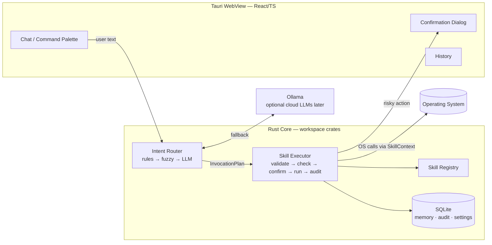

# Jarvis

**Local-first desktop AI assistant that turns natural language into safe, auditable actions.**

> **Status: pre-MVP — Windows-only, no stable APIs, not ready for production use.**

---

## What it is

Jarvis is a keyboard-driven command palette and chat interface for your desktop. You type
a request in any language; Jarvis routes it to a declared skill, validates parameters,
asks for confirmation when needed, executes it, and writes every attempt to an audit log.

## What it is not

- **Not a chatbot.** Jarvis executes actions on your computer; conversation is a side effect.
- **Not an autonomous code executor.** The LLM selects a declared skill with validated
  parameters. It never runs arbitrary shell commands or code. Safety is structural.
- **Not a cloud product.** The core runs fully offline with Ollama. Cloud LLMs are
  optional, future additions.

---

## Key features (MVP v0.1)

| Feature | Detail |
|---|---|
| Global hotkey | Alt+Space opens the palette from anywhere |
| Hybrid routing | Rules → fuzzy match → Ollama LLM; most commands never hit the model |
| 8 built-in skills | open app, open folder, search files, convert images, system info, processes, open URL, memory |
| Multilingual input | Type in any language; routing handles it — no separate i18n pipeline for input |
| Permission model | Every skill declares permissions and risk; Moderate+ risk requires confirmation |
| Audit log | Append-only log of every execution attempt, including denials — visible in History UI |
| Structured memory | Store and recall key-value facts ("my projects folder is D:\dev") |
| Offline-first | Full functionality with Ollama; no network required |

---

## Architecture



The UI is untrusted: it renders and collects input but cannot touch the OS. Only the Rust
core can. The LLM is also untrusted: its output is always schema-validated and
permission-checked before anything runs. A hallucinated skill ID or parameter is rejected,
never attempted.

---

## Security model

1. **LLM proposes; platform executes.** The model produces a structured `InvocationPlan`
   (JSON). The executor validates it against the skill's JSON Schema, checks declared
   permissions, and runs it via the `Skill` trait. No raw shell strings ever reach the model.
2. **Declared permissions.** Each skill manifest lists exactly what it needs
   (`FsRead`, `FsWrite`, `Process`, `Network`). Undeclared access is impossible.
3. **Risk levels.** `Safe` skills run silently. `Moderate` and `Destructive` skills show a
   confirmation dialog with a human-readable parameter preview before executing.
4. **Audit log.** Every execution attempt — including denials and failures — is written to
   an append-only SQLite table and shown in the History page.
5. **Prompt injection stance.** Content read from files or the web is returned to the user
   as data; it is never fed back into the router as instructions.

---

## Local model setup (Ollama)

Ollama is the only required AI dependency. Jarvis detects it on startup and offers a
guided install link if it is missing.

1. Install Ollama from <https://ollama.com>.
2. Pull a routing model — a small instruct model works well:
   ```
   ollama pull qwen2.5:3b
   ```
3. Start Ollama (`ollama serve`) if it does not start automatically.
4. On first launch Jarvis will let you choose Fast / Balanced / Capable presets that map
   to different model sizes.

Cloud LLM backends are not implemented in MVP. They will be optional, behind the same
`LlmClient` trait, in a future release.

---

## Project structure

```
jarvis/
  app/                  # Tauri 2 application
    src-tauri/          # Rust host: commands, window, tray (thin — delegates to crates)
    ui/                 # React + TypeScript + Vite
  crates/
    jarvis-types/       # shared types, Skill trait, manifests  [frozen interface]
    jarvis-router/      # rules + fuzzy + LLM routing
    jarvis-skills/      # built-in skills (one module per category)
    jarvis-store/       # SQLite: memory, audit, settings, migrations
    jarvis-llm/         # LlmClient trait + Ollama impl
  skills/               # skill manifests as .json (embedded at build)
  docs/                 # architecture, ADRs, vision, roadmap
```

---

## Quick start

**Prerequisites:** Rust stable, Node 20+, and the
[Tauri 2 Windows prerequisites](https://v2.tauri.app/start/prerequisites/) (WebView2,
Visual Studio C++ build tools).

```powershell
# Clone and enter the repo
git clone https://github.com/timapogorelov/local-agent-platform.git
cd local-agent-platform

# Install UI dependencies
cd app/ui && npm install && cd ../..

# Run in development mode (builds Rust + starts Vite dev server)
cd app && npm run tauri dev
```

Run tests and linting:

```powershell
cargo test
cargo clippy -- -D warnings
cd app/ui && npm run build
```

---

## Roadmap

| Phase | Theme | Key additions |
|---|---|---|
| **v0.1 MVP** | Safe execution | 8 skills, router, permissions, audit log, Ollama |
| **v0.2** | Automation | Scheduler, watchers, routines, +10 skills (git, docker, pdf, clipboard) |
| **v0.3** | Memory & extensibility | Semantic memory (sqlite-vec), Python sidecar skills, skill dev docs |
| **v0.4** | Voice & polish | whisper.cpp push-to-talk, TTS, auto-updater, macOS support |
| **v1.0** | Platform | Third-party skill packages, skill catalog, Linux support, cloud LLMs |
| **v2+** | Agentic | Multi-step planning, background agents |

A phase starts only when the previous phase's success criteria are met and any
frozen-interface changes are recorded as ADRs.

---

## Screenshots

Screenshots coming after MVP.

---

## Contributing

See [CONTRIBUTING.md](CONTRIBUTING.md).

---

## License

MIT — see [LICENSE](LICENSE).
