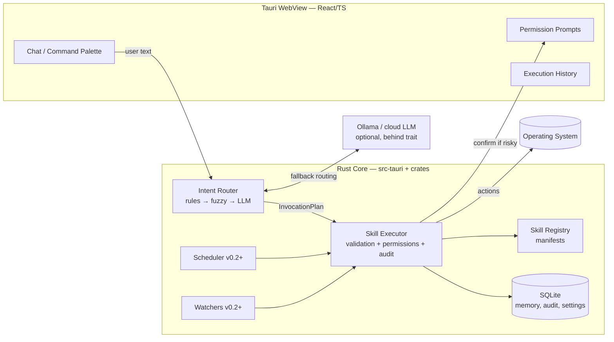

# Jarvis — Architecture

Status: **frozen for MVP** (interfaces marked 🔒 must not change without an ADR).

## 1. System Overview



## 2. Trust Zones
1. **UI (untrusted-ish)**: renders, collects input, shows confirmations. Cannot execute.
2. **Core (trusted)**: the only component that touches the OS. Enforces permissions.
3. **LLM (untrusted)**: text in → structured JSON out. Output is *always* schema-validated
   and permission-checked. A hallucinated skill id or param is rejected, never "tried".

## 3. Core Data Types 🔒 (crate `jarvis-types`)

```rust
/// What the router produces from user input.
pub struct InvocationPlan {
    pub steps: Vec<SkillInvocation>,   // MVP: always len 1; routines reuse this later
    pub source: RouteSource,           // Rule | Fuzzy | Llm
    pub confidence: f32,
}

pub struct SkillInvocation {
    pub skill_id: String,              // e.g. "system.open_app"
    pub params: serde_json::Value,     // validated against manifest's JSON Schema
}

pub enum RiskLevel { Safe, Moderate, Destructive }

pub struct SkillManifest {
    pub id: String,                    // "category.name"
    pub version: semver::Version,
    pub description: String,           // English; used in LLM routing prompt
    pub params_schema: serde_json::Value,  // JSON Schema
    pub permissions: Vec<Permission>,  // FsRead(scope), FsWrite, Process, Network, Shell
    pub risk: RiskLevel,
    pub examples: Vec<String>,         // few-shot examples for the router
}

pub struct SkillOutput {
    pub summary: String,               // English canonical; UI may translate via LLM
    pub data: serde_json::Value,
}

#[async_trait]
pub trait Skill: Send + Sync {        // 🔒 the one extension point
    fn manifest(&self) -> &SkillManifest;
    async fn execute(&self, params: serde_json::Value, ctx: &SkillContext)
        -> Result<SkillOutput, SkillError>;
}
```

`SkillContext` provides: scoped fs/process helpers, memory read access, a progress
reporter, and a `request_confirmation()` channel. Skills must use these helpers rather
than raw `std::fs`/`std::process` — this is enforced by review/lint, not sandboxing,
until out-of-process workers arrive (v0.3+).

## 4. Routing Pipeline 🔒

```
user text ──► 1. Rule match      (exact/regex per-skill triggers)        ~0 ms
          └─► 2. Fuzzy match     (skill examples, multilingual aliases)  ~1 ms
          └─► 3. LLM route       (manifest catalog → JSON, schema-validated, 1 retry)
          └─► 4. Clarify         (ask user; never guess on Destructive)
```

The LLM router prompt contains: skill catalog (id + description + examples), the user
text, and instructions to output `InvocationPlan` JSON. Multilingual input is handled
here — no separate i18n pipeline for input.

## 5. Execution Pipeline 🔒

```
InvocationPlan
  → schema-validate params against manifest
  → permission check (skill's declared perms vs user's grants)
  → if risk ≥ Moderate (configurable): UI confirmation with human-readable preview
  → execute via Skill trait
  → write AuditRecord (always, including refusals/failures)
  → return SkillOutput to UI
```

## 6. Storage (SQLite, single file `jarvis.db`)

Tables (MVP): `settings`, `memory_facts(key, value, source, updated_at)`,
`audit_log(ts, skill_id, params_json, risk, outcome, source)`,
`conversations`, `messages`. v0.2 adds `schedules`, `watchers`, `routines`.
v0.3 adds `memory_embeddings` via `sqlite-vec`.

Location: `%APPDATA%/jarvis/` (Windows), `~/Library/Application Support/jarvis/` (macOS),
`~/.local/share/jarvis/` (Linux). Migrations via `sqlx::migrate!`.

## 7. Repository Layout

```
jarvis/
  app/                  # Tauri 2 application
    src-tauri/          # Rust host: commands, window, tray (thin — delegates to crates)
    ui/                 # React + TypeScript + Vite
  crates/
    jarvis-types/       # 🔒 shared types, Skill trait, manifests
    jarvis-router/      # rules + fuzzy + LLM routing
    jarvis-skills/      # built-in skills (one module per category)
    jarvis-store/       # SQLite: memory, audit, settings, migrations
    jarvis-llm/         # LlmClient trait + Ollama impl (+ cloud impls later)
  skills/               # manifests as .json (source of truth; embedded at build for MVP)
  docs/                 # this folder
```

## 8. Subsystem Status

| Subsystem | MVP | Notes |
|---|---|---|
| Chat + palette UI | ✅ | one window, global hotkey |
| Intent router (rules+fuzzy+Ollama) | ✅ | |
| Skill registry + executor + 8 skills | ✅ | in-process Rust |
| Permissions + confirmations + audit | ✅ | |
| Structured memory | ✅ | key-value facts |
| Scheduler, watchers, routines | v0.2 | reuse `InvocationPlan` |
| Semantic memory (sqlite-vec) | v0.3 | |
| Out-of-process skills (Python sidecar) | v0.3 | same manifest format |
| Voice (whisper.cpp push-to-talk) | v0.4 | |
| Plugins/marketplace/signing, multi-agent | v1+ | |
